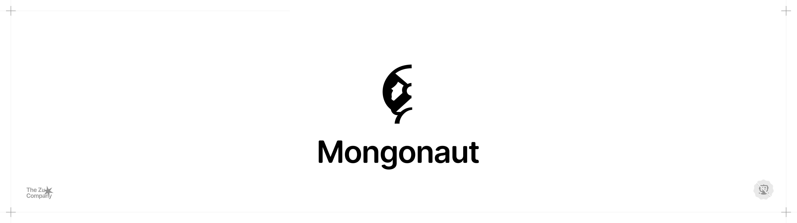

    

  

## About Mongonaut

Mongonaut is a lightweight and easy-to-use MongoDB web-service to manage your MongoDB built with [Next.js](https://nextjs.org/).

> 🚧 **Work in Progress!** Currently released in an early beta state.

## Installation and Securing

How to install and secure Mongonaut is explained in our [documentation](https://mongonaut.org/docs).

## License

Mongonaut is a [The Zu Company](https://thezucompany.com) Product, licensed under the [MIT License](LICENSE).
